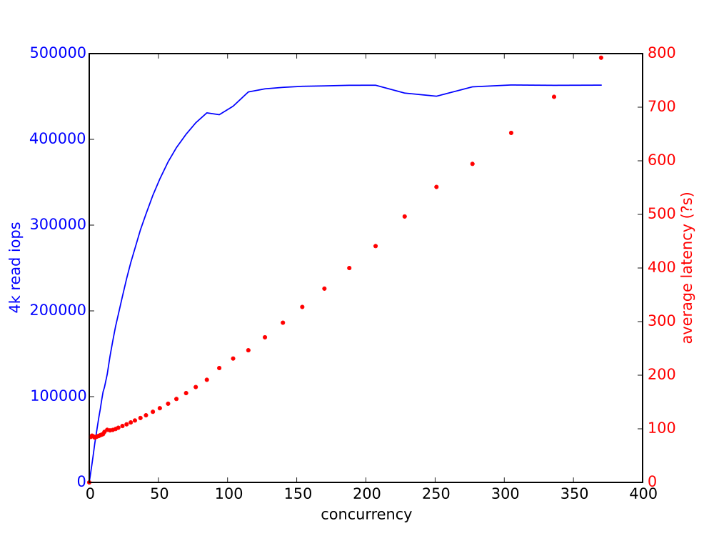

Diskplorer - disk latency/bandwidth grapher
===========================================

*Diskplorer* is a small wrapper around <code>[fio](https://github.com/axboe/fio)</code>
that can be used to graph the relationship between concurrency (I/O depth) and
throughput/IOPS.

## Requirements

Diskplorer requires:

1. Python 3
2. python3-matplotlib
3. fio (version 2.0.10 or later)

On Fedora 23, the dependencies can be installed via:

 dnf install python3-matplotlib fio

## Running *diskplorer*
 
Running `diskplorer.py` will create a 100GB test file in the current directory,
and produce a graph named `disk-concurrency-response.svg` in the same place.
The test file is not deleted after a run.

*Diskplorer* also support the following command-line options:

    -h, --help            show this help message and exit
    -d MOUNTPOINT, --mountpoint=MOUNTPOINT
                          Test disk mounted at MOUNTPOINT
    -b DEV, --device=DEV  Test block device DEV (overrides --mountpoint)
    -s SIZE, --filesize=SIZE
                          Set SIZE as file size for test
    -m N, --max-concurrency=N
                          Test maximum concurrency level N
    -o FILE, --output=FILE
                          Write output graph to FILE

## Example results

Here are results on a fairly good NVMe SSD.  At its peak, the drive is delivering 1.8GB/sec.

